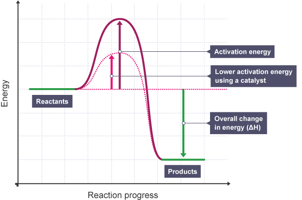
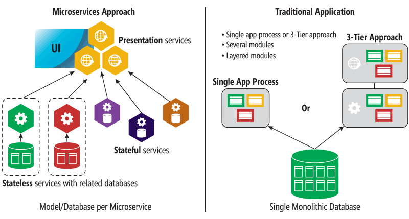
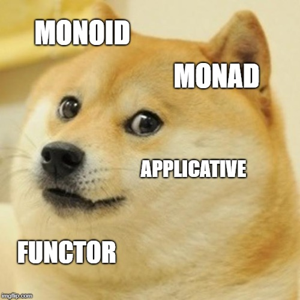

- title : Easing F# Adoption
- description : Easing F# Adoption.
- author : Colin Bull
- theme : league
- transition : default

***

# Easing F# Adoption

' Introduce yourself
' Explain successful introduction of F#

***

### Not about idomatic code

' Sorry we aren't trying to be purist
' Should still make an effor to be pure.
' Still follow Scotts guidelines 
' Illegal states unrepresentable

***

### Scaling the F# message

' This is important as it helps sharing
' Bit like the gossip protocol.
' Conferences are great, but preaching to the converted

***

### Some context first

***

### Enterprises aren't software houses

They **do not** aspire to be best in market with software,
but they **do** recongise the value of software.

' This seems like a contradiction
' But really means they don't want to train.
' Fall back to relying on buying in.

***

> Nobody got fired for hiring {insert-consultancy-here} 

' Getting F# pushed into the consultancies solves one problem
' Getting it on industry reports, Gartner, Forrester etc. will help
' Ultimately thou we need to get to dark matter dev

***

### An outsourced enterprise

' Dark matter devs mostly
' Teams rotate quickly 
' Target is not to be a dev, but to get on management track
' To compound this.... 

*** 

### The Stack Overflow survey

' Architects will apply this blindly
' I'm surprised I don't have to write everything in Node
' To cover all basis

***

### But there is a bigger problem

***

### C# Is really quiet good at this stuff

' Why should a dark matter dev care? 
' Will it help them get up the career ladder
' Investment in learning. 

***

## How do we deal with this? 

***

### Advertise F# features 

* Pattern matching / Active Patterns 
* Type providers 
* Async 
* Immutability 
* Discriminated Unions
* etc.. 

' You might get a small response
' Most likely a shrug thou.
' They will still need to learn more than they can cut and copy
' Focusing on FSharp.Core won't help either

***

### Use quantative evidence

***

### Use Gateway drugs 

* Build
* Dev ops scripts
* Generate Test data

' Build is actually quiet risky. Architects lurk here.
' Devops, if you have that then your probably not going 
' to need the rest of this talk

***

### Consider your environment

How can I apply F# with minimal fuss

' Think how does F# apply in your environment
' Can you actually use type providers Firewalls 
' DB access
' It is hard not to just showcase consice syntax.
' When you do showcase F#... 

***

### Lower mismatch with C#

' We need to be able to write F# that isn't like a slap in the face  
' Even though the C# isn't 
' The rest of the talk will focus on this.

***

### Composing with let 

    let doStuff = f >> g

### vs 

    let doStuff f g a = 
        let y = f a
        g y

' Interesting - Intermediate values
' Many newcomers aren't used to REPL lifestyle
' Still want to set breakpoints to debug

***

### Arrgh! Custom operators

    type Trade = 
        { Product:string; Volume:float }
        static member Create (product,volume) = 
            { Product = product; Volume = volume }

    let inline (!!) = Trade.Create

    let trade : Trade = !! ("power", 5000) 

###  vs 

    type Trade = 
        { Product:string; Volume:float }
        static member Create (product,volume) = 
            { Product = product; Volume = volume }

    let trade = Trade.Create ("power", 5000)

' contrived example but gets the point across
' I have seen this example many times 
' Readability trumps consicseness

***

### Oh yeah! Member constraints

    let inline (!!) (b : ^b) : ^a = 
        (^a : (static member Create : ^b -> ^a) (b))
    
' Cryptic syntax. 
' Rarely are actually required
' Often other ways to encode this Interfaces for example

***

### Interfaces or Record of functions 

    type ProductRepository = {
        Get : string -> Product 
        Save : Product -> unit 
    } 

### vs 

    type IProductRepository = 
        abstract Get : string -> Product 
        abstract Save : Product -> unit

' More familiar to C# devs
' Allows generic methods 
' Object expressions allow you to turn these into values

***

### Write interop interfaces in C#

* Carefully consider how you expose FSharp.Core
* Consider using `[<CompiledName>]` attribute
* Try to limit sharing to value types. 

' Some FSharp types are interesting to use from C#
' Provides a clear boundary
' Value types limit action at a distance issues
' Compiled Name to get naming conventions inline

***

### Utilise the .NET ecosystem 

* Giraffe and ASPNET Core 
* Newtonsoft.Json
* PdfSharp
* etc..

' F# runs on the CLR utilise the libraries
' Can always wrap in a facade
' Get to F# types as quickly as possible

***

### Structuring modules 

###### image - http://houseofbots.com/news-detail/519-1-monolithic-to-microservices-architecture-scalable-approach

' Consider modules like microservices
' n-tier seperate dataaccess and domain logic 

***

    module Trade = 

        let computeVolume trade = ...

    module DataAccess = 

        let saveTrade trade = ...

### vs 

    module Trade = 

        let computeVolume trade = ...

        let save trade = ...

' higher cohesion
' don't violate SRP in functions thou 
' similar considerations to microservices
' notice in the picture stateful services

***

### As for the stateful ones

    module StatefulModule = 

        let private mutable state = 1

        let doStuff() = ..

### prefer objects 

    type StatefulObject(myState) = 

        let mutable state = myState

        member __.DoStuff() = ..
   
' When learning functional programming this seems like a paradox. 
' F# is a very good object oriented language use it
' If you have state, then an object is a good place to store it

***

### Consider dependencies 

    module Trade = 

        let update (eventHub:IEventHub option) f trade = ... 

### vs 

    type TradeService(eventHub:IEventHub) = 

        member x.UpdateTrade(trade:Trade, updateFunc) = 
            let newTrade = Trade.update updateFunc trade
            evntHub.raise (TradeUpdated(trade, newTrade))
            newTrade 

' Allows injection of cross cutting services
' Improves ability to add dependencies
' Allows you to use Trade.update without dragging in baggage.

*** 

### Select your abstractions wisely

*** 

### These are all super powerful abstractions

' You definitely should learn and apprciate them
' but

*** 

' No simple answers not going to scale
' Hence the number of monad tutorials
' At the begining of the talk I mentioned darket matter dev investment
' They aren't going to invest in this
' but these are useful, why?

***

### Consider the next reader for the best result.

    let attemptReadMapProduct row = 
        result { 
            let! marketArea = read<String> "marketarea" row
            let! product = read "product" row 
            return! tryMapProduct marketArea product
        }

### vs 

    let attemptReadMapProduct row = 
        read<String> "marketarea" row
        >>= (fun ma -> 
                read<String> "product" row
                >>= (fun prod -> tryMapProduct ma prod)
            )  

' provides a nice middle ground
' hides detail can still be utilised
' enables debugging
' also can be a little bit like a virus.
' end up infecting the whole call chain.

***

### But do you really need

    let foo = 
        asyncReaderStateResult { ... }

### or 

    let writeLine = 
        io { .. }

###### Probably not.

' First class support for I/O, Exceptions and mutation.
' These layer complexity 
' What happens if you get the implementation wrong.
' No one will thank you for that. 
' People abandon. Honestly.

*** 

### Limit to well known abstractions 

* Maybe
* Result / Attempt 
* Async

' These are well understood 
' Although maybe and result builders aren't part of FSharp.Core 
 
***

# F# <> Haskell 

***

### In summary

* If you can explain it in a way that scales use it
* If not introduce a stepping stone
* Rinse and repeat

' Else you will do a lot of explaining.
' Wait until you feel enough ppl grok it

***

# Thanks for listening!!

Twitter: @colinbul

*** 

### Questions?
